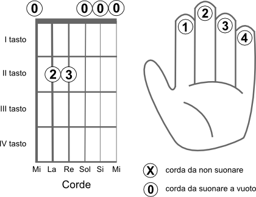
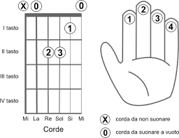

# I Primi Accordi: Mi Minore e La Minore

In questa lezione vengono introdotti i primi due accordi fondamentali. La scelta di iniziare con il **Mi minore** e il **La minore** è dovuta al fatto che sono considerati i più semplici da eseguire per un principiante e sono strutturalmente molto simili tra loro. Per impararli, si utilizzano i box (diagrammi), che rappresentano graficamente la tastiera con linee di spessore differente per distinguere le corde (dalla più sottile, il Mi cantino, alla più spessa, il Mi basso).

## 1. Mi Minore (E minor)

È il primo accordo del percorso e si ottiene posizionando le dita come segue:

* **Mano che preme (Sinistra)**: Il **dito 2 (medio)** va al secondo tasto della quinta corda e il **dito 3 (anulare)** al secondo tasto della quarta corda.
* **Mano che suona (Destra)**: Per questo accordo devono risuonare **tutte le 6 corde**.
* **Suggerimento tecnico**: Posiziona le dita il più vicino possibile al tasto (verso il corpo della chitarra) per applicare meno forza e ottenere un suono più pulito.

## 2. La Minore (A minor)

Questo accordo è una variazione diretta del precedente:

* **Mano che preme (Sinistra)**: Si spostano le dita 2 e 3 **una corda più in basso** (rispettivamente sulla quarta e sulla terza corda) e si aggiunge il **dito 1 (indice)** al primo tasto della seconda corda.
* **Mano che suona (Destra)**: Idealmente si dovrebbe colpire dalla **quinta corda in giù**. Tuttavia, se si tocca accidentalmente la sesta corda (Mi basso), il suono non risulterà sgradevole poiché quella nota fa comunque parte dell'accordo.

**Consigli pratici per l'esecuzione**

* **Evitare interferenze**: Una delle difficoltà maggiori è evitare che i polpastrelli "stoppino" involontariamente le corde sottostanti che devono suonare a vuoto.
* **Postura**: Dopo aver trovato la posizione delle dita, cerca di **mantenere la schiena dritta** ed evita di incurvarti troppo sopra lo strumento.
* **Fluidità**: L'obiettivo principale è riuscire a passare da un accordo all'altro nel modo più **fluido e continuo possibile**, anche se inizialmente il cambio potrà sembrare difficile.
